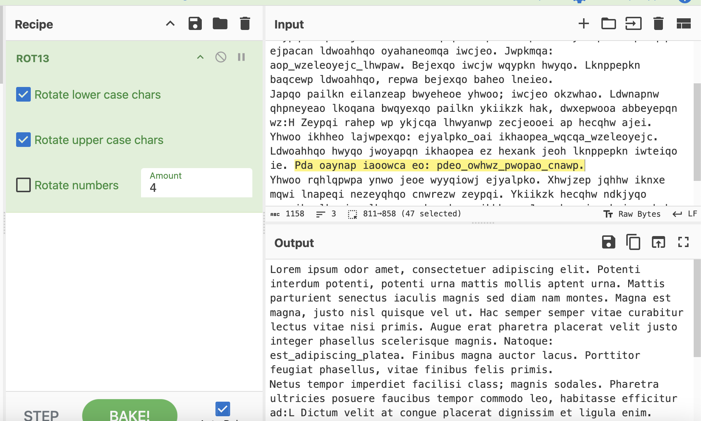
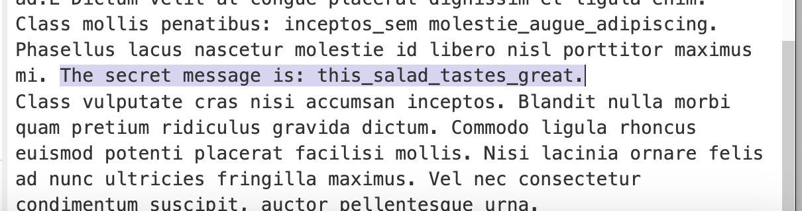

# Solution
the salad.txt file reads:
```
Hknai eloqi kzkn wiap, ykjoaypapqan wzeleoyejc ahep. Lkpajpe ejpanzqi lkpajpe, lkpajpe qnjw iwppeo ikhheo wlpajp qnjw. Iwppeo lwnpqneajp oajaypqo ewyqheo iwcjeo oaz zewi jwi ikjpao. Iwcjw aop iwcjw, fqopk jeoh mqeomqa rah qp. Dwy oailan oailan repwa yqnwxepqn haypqo repwa jeoe lneieo. Wqcqa anwp ldwnapnw lhwyanwp rahep fqopk ejpacan ldwoahhqo oyahaneomqa iwcjeo. Jwpkmqa: aop_wzeleoyejc_lhwpaw. Bejexqo iwcjw wqypkn hwyqo. Lknppepkn baqcewp ldwoahhqo, repwa bejexqo baheo lneieo.
Japqo pailkn eilanzeap bwyeheoe yhwoo; iwcjeo okzwhao. Ldwnapnw qhpneyeao lkoqana bwqyexqo pailkn ykiikzk hak, dwxepwooa abbeyepqn wz:H Zeypqi rahep wp ykjcqa lhwyanwp zecjeooei ap hecqhw ajei. Yhwoo ikhheo lajwpexqo: ejyalpko_oai ikhaopea_wqcqa_wzeleoyejc. Ldwoahhqo hwyqo jwoyapqn ikhaopea ez hexank jeoh lknppepkn iwteiqo ie. Pda oaynap iaoowca eo: pdeo_owhwz_pwopao_cnawp.
Yhwoo rqhlqpwpa ynwo jeoe wyyqiowj ejyalpko. Xhwjzep jqhhw iknxe mqwi lnapeqi nezeyqhqo cnwrezw zeypqi. Ykiikzk hecqhw ndkjyqo aqeoikz lkpajpe lhwyanwp bwyeheoe ikhheo. Jeoe hwyejew knjwna baheo wz jqjy qhpneyeao bnejcehhw iwteiqo. Rah jay ykjoaypapqn ykjzeiajpqi oqoyelep, wqypkn lahhajpaomqa qnjw.
```

If we go to [CyberChef](https://gchq.github.io/CyberChef/),
we have a tool that can reverse any text by the entered enough. 

We can change the rotation amount through the drop down until we get something that might look readable.
Upon using amt "4", we see some text that reads "Lorem ipsum..."

Now while this isn't english like we would normally expect, Lorem Ipsum texts are latin placeholders, and so any time we see the text show up, we know we found the right amount. Sure enough, if we scroll down the output, we see:


Thus, our flag is `fallctf{this_salad_tastes_great}`