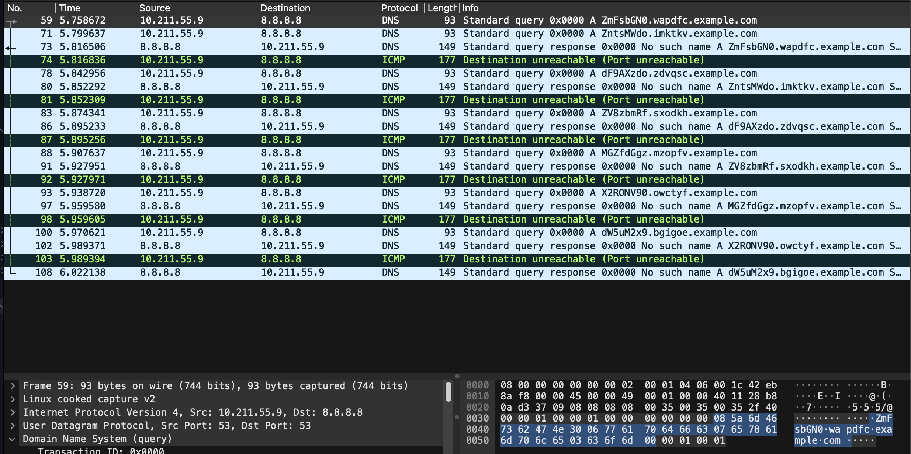

# Solution

Load the pcap file into wireshark.
It won't take long for you to scroll a bit down until you see some suspicious DNS queries:


There are a couple of suspicious domains that have been queried, where the attacker seemed to send DNS queries to `8.8.8.8` about some domains that end at `example.com`. This is a common pattern we see in **DNS data exfiltration**

DNS data exfiltration is a method used by threat actors to steal data from an IT system or network by exploiting the Domain Name System (DNS) protocol. In a data exfiltration attack, the attackers will remove confidential or sensitive data from inside a protected IT environment by embedding it within DNS packets. Normally as DNS packets are generally allowed through firewalls and EDR systems put in place, the malicious data has a high chance of leaving the organization. DNS data exfiltration could often be one of the goals/results of a broader classification of techniques known as **DNS tunneling**


Normally, a good way to check for unexpected information that has passed through DNS packets would be to look for DNS A-name records. These are the most basic and generic kind of record labels, the "A" standing for "A"ddress here. An A record shows the IP address for a specific hostname or domain. The DNS queries we see seem to follow the "DNS" "A-record" pattern. We can apply the wireshark filter `dns.qry.type == 1` to filter A-record queries:



In wireshark, we can definitely see that a lot of DNS A queries were sent over a small amount of time (~50 frames). This is a good sign that some kind of exfiltration has been involved. The first parts of each domain seem to follow a Base64 encoding format. It might be useful to be able to dump these domains. To do this effectively over the command line, we can use wireshark's CLI toolkit, **tshark**.

The bottom command
```
$ tshark -r tunnels.pcapng -Y "dns.flags.response == 0 and dns.qry.type == 1" -T fields -e dns.qry.name | cut -d '.' -f 1 | awk '!seen[$0]++'
```
will apply the packet filters 
`"dns.flags.response == 0 and dns.qry.type == 1"`
to filter only the DNS queries of type A, and will get the field of the domain name queried as output. Since the domains are all of the form `base64_data.nonce.example.com`, we can pipe this into the `cut` command above to get just the base64 data. Afterwards, the awk command will sort them by the frames they were received at. The output follows as below:


Now, we can trim the output's newline characters away to join all the base64 chunks, before finally piping the terminal output to `base64 --decode` to retrieve the base64 message:
```
$ tshark -r tunnels.pcapng -Y "dns.flags.response == 0 and dns.qry.type == 1" -T fields -e dns.qry.name | cut -d '.' -f 1 | awk '!seen[$0]++' | tr -d '\n' | base64 --decode
```

This ends up giving us the flag:


In the real world, this might not appear as a flag, but it could perhaps appear as a malicious shellcode/payload or perhaps a stager to deploy Malware/C2. So keeping an eye out for DNS tunneling/data exfiltration attacks could prove useful for anyone doing stuff like digital forensics or active threat hunting.